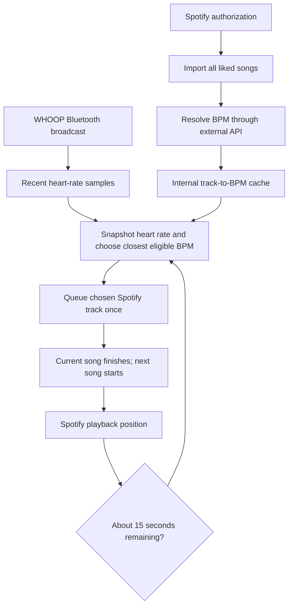

# Spotify liked songs + WHOOP BPM DJ

Researched: September 15, 2026. Status: initial browser implementation built; real Spotify/WHOOP device verification remains pending.

## Implementation status

Implemented at `/whoop/music`: Spotify authorization with encrypted cookies, paginated liked-song import, exact-ID ReccoBeats lookup, a browser cache per account, Web Bluetooth heart-rate notifications, direct BPM selection, and a controller that queues the next song approximately 15 seconds before completion. Setup instructions are in the README.

The first version uses a seven-day browser cache, not a shared server database. GetSongBPM and Soundcharts remain alternatives rather than active adapters. The controller requires a visible supported browser tab and stops on queue conflicts or sensor failures. iPhone/Safari and native background operation are not implemented. Automated tests cover the isolated components; a simulated browser test exercises import and two consecutive song decisions. Real playback requires configured Spotify credentials, a Premium account, and WHOOP hardware.

## Intended behavior

Import the signed-in user's Spotify liked songs, resolve their BPM through an external music database, and maintain an internal lookup cache. During playback, use live WHOOP heart rate to choose the liked song whose BPM is closest.

**Make the selection approximately 15 seconds before the current song ends, starting with the first song and repeating for every subsequent song. Queue the selection then; let the current song finish naturally.**

Example: for a four-minute song, make the decision at approximately 3:45. If heart rate is 143 and eligible songs have tempos of 128, 140, 145, and 162 BPM, queue the 145 BPM song.

## Data flow

## BPM database options

These services supply lookup data; music playback remains through Spotify. Coverage of a user's complete library is unverified.

| Provider | Lookup approach | Access and limits | Suggested role |
| --- | --- | --- | --- |
| [ReccoBeats](https://reccobeats.com/docs/documentation/introduction) | Resolve Spotify ID using `GET /v1/track?ids=...`, then retrieve audio features by returned ID | Free, no API key. Numeric rate limits are not published; handle HTTP 429 and Retry-After. | First prototype candidate; a live lookup succeeded. |
| [GetSongBPM](https://getsongbpm.com/api) | Search title and artist, then use the provider's song ID; responses include `tempo` | Free API key with mandatory backlink, including private projects. Published limit: 3,000 requests/hour. | Candidate fallback for missing songs; text matching requires care. |
| [Soundcharts](https://developers.soundcharts.com/api/reference/song/get-song-metadata?version=v2) | Resolve by Spotify/platform ID or ISRC, then fetch song metadata containing tempo | Authenticated, plan-dependent access. Confirm audio-feature entitlement, price, quotas, and caching terms. | Paid alternative to evaluate if prototype coverage is insufficient. |

### ReccoBeats: verified example

Base URL: `https://api.reccobeats.com`.

Read-only requests run during this research:

1. `GET /v1/track?ids=0VjIjW4GlUZAMYd2vXMi3b`
2. Returned The Weeknd's **Blinding Lights**, provider ID `25c8ca63-5895-4572-84eb-a7040bc08c4d`, and ISRC `USUG11904206`.
3. `GET /v1/track/25c8ca63-5895-4572-84eb-a7040bc08c4d/audio-features`
4. Returned `tempo: 171.001` with the same Spotify link and ISRC.

A separate lookup for Spotify's documentation example ID `11dFghVXANMlKmJXsNCbNl` returned an empty `content` array. This confirms that missing mappings need explicit handling; these two checks do not establish catalog-wide coverage or BPM accuracy.

ReccoBeats describes its audio features as its own analysis and its base metadata as originating from Spotify. Its service has no availability guarantee. The terms reviewed do not explicitly establish unrestricted permanent database retention.

Sources: [track lookup](https://reccobeats.com/docs/apis/get-tracks), [audio features](https://reccobeats.com/docs/apis/get-track-audio-features), [rate limits](https://reccobeats.com/docs/documentation/rate-limiting), [terms](https://reccobeats.com/docs/documentation/terms-of-service).

### GetSongBPM: fallback details

Base URL: `https://api.getsong.co/`. Keep the API key server-side and send it through `X-API-KEY`.

- Search: `GET /search/?type=both&lookup=<URL-encoded song:TITLE artist:ARTIST>`.
- Details: `GET /song/?id=<provider-song-id>`.
- Parse `tempo` as a number; documentation examples also show string values.
- Its documented search flow uses artist/title rather than a direct Spotify-ID lookup. Reject ambiguous versions instead of accepting the first result.

API behavior, access requirements, and limits are documented on the [official API page](https://getsongbpm.com/api). Authenticated calls were not tested.

### Soundcharts: alternative details

Resolve the recording using its platform ID or ISRC, then call `GET /api/v2/song/{uuid}` for metadata. Its documentation defines tempo as estimated BPM and identifies this as a plan-restricted endpoint. Do not assume a dashboard subscription includes the required API access.

Sources: [song metadata endpoint](https://developers.soundcharts.com/api/reference/song/get-song-metadata?version=v2), [audio features product](https://soundcharts.com/en/audio-features-api). Authenticated calls and pricing were not verified.

### Provider selection

Start by measuring ReccoBeats coverage on 100–200 authorized liked tracks spanning older songs, recent releases, remixes, and less popular artists. Record exact matches, missing BPMs, ambiguous versions, latency, and rate-limit responses. Evaluate GetSongBPM against misses. Consider Soundcharts after confirming its access cost and recording coverage.

Use a provider interface so changing the lookup source does not change playback logic. No provider should be assumed to cover every liked song.

## Spotify library import and cache

- Authorize each user with `user-library-read`, `user-read-playback-state`, and `user-modify-playback-state`.
- Paginate through `GET /v1/me/tracks` until complete; respect rate limits and token expiry.
- Store per-user liked-track membership separately from BPM entries. Reconcile removed likes after successful full syncs; do not remove records because a partial import failed.
- Prefer an exact Spotify-ID match, then ISRC when available, then carefully validated artist/title/version matching. ISRC may not be present in every response or access mode.
- Store unknown or ambiguous BPM explicitly. Never substitute zero or invent a tempo.
- Perform enrichment during import/background work so playback selection only reads the cache.

Suggested BPM entry:

| Field | Purpose |
| --- | --- |
| `spotifyTrackId`, `spotifyUri` | Lookup and playback identity |
| `bpm` | Nullable numeric tempo |
| `provider`, `providerTrackId` | Source provenance |
| `matchMethod` | Spotify ID, ISRC, or validated metadata |
| `lookupStatus` | Pending, matched, missing, ambiguous, or failed |
| `fetchedAt`, `expiresAt`, `retryAfter` | Refresh and retry lifecycle |

Keep only necessary metadata, define retention according to both providers' terms, and remove user-specific library records when disconnected. Spotify restricts storage beyond what is necessary for an application; this is an operational cache, not an unrestricted permanent catalog.

Sources: [saved tracks](https://developer.spotify.com/documentation/web-api/reference/get-users-saved-tracks), [Spotify terms](https://developer.spotify.com/terms).

## Live heart-rate input

WHOOP supports heart-rate broadcasting over Bluetooth Low Energy; continuous heart rate is unavailable through its cloud API. The listener must run on a device near the band. A remote Next.js server cannot receive that Bluetooth signal directly. [WHOOP developer FAQ](https://developer.whoop.com/docs/developing/support/)

Proposed implementation:

- Enable WHOOP heart-rate broadcast and connect a client-side Bluetooth listener.
- Keep a small timestamped sample buffer on the listening device.
- At the 15-second decision point, use the average of the preceding five seconds as the target. The five-second smoothing window is an adjustable implementation default.
- Require the latest sample to be no more than five seconds old. On a stale/disconnected sensor, retain an already confirmed next track; otherwise leave normal playback alone and show that live matching is unavailable.
- Choose the supported client platform during the Bluetooth spike. Verify browser Bluetooth support and foreground/background behavior before promising mobile web or lock-screen operation; a native bridge may be needed.

## Selection and playback scheduling

### Matching

1. Filter to the user's liked, playable tracks with valid BPM.
2. Exclude the current song and, initially, the five most recently played tracks. Relax history exclusions if the library is too small, while avoiding an immediate repeat when another candidate exists.
3. Minimize `abs(songBpm - targetHeartRate)`.
4. Break ties by least recently played, then stable track ID.

Use direct BPM matching for this feature. The existing matcher includes half/double tempo and energy weighting, which can select a different song from the direct closest match.

### Decision at 15 seconds remaining

Track duration, position, paused state, active device, and the current playback occurrence. Extrapolate position between playback-state refreshes only while playing, and resynchronize after pause, seek, device change, or track change.

When estimated remaining time first crosses 15,000 ms:

1. Verify that this playback occurrence has no committed next-track decision.
2. Snapshot fresh heart-rate samples and select from the local cache.
3. Recheck the active track/device before submitting the command.
4. Submit `POST /v1/me/player/queue?uri=<encoded-Spotify-URI>` for the selected device.
5. Verify the queue and mark the decision committed. Do not change it for every subsequent heart-rate update.
6. Let Spotify finish the current song and transition naturally. Begin tracking a new playback occurrence when the next song starts.

For a forward seek into the final 15 seconds, select immediately if no decision exists. Cancel uncommitted work on a skip. A backward seek after queue commitment must not enqueue a duplicate. Short songs or a late session start use the same immediate-selection rule. Identify occurrences separately from track IDs so later replays work.

Use bounded retries for definite failures. After an uncertain network timeout, inspect the queue before retrying: an accepted command may otherwise be duplicated. Stop scheduling when the user stops the DJ session.

### Queue constraints to validate early

The queue API requires Premium and does not guarantee ordering when mixed with other player commands. An accepted request is not proof of the final queue position. Existing queued tracks, repeat, shuffle, device changes, and external user actions can disrupt the intended next song. [Spotify queue endpoint](https://developer.spotify.com/documentation/web-api/reference/add-to-queue)

Prototype with a dedicated DJ session and verify the selected track is actually next. Do not promise arbitrary queue replacement or removal: the documented queue interface does not provide those controls. If a conflicting queue prevents the intended transition, report the conflict and suspend automatic scheduling rather than silently appending more choices. Validate an empty-queue setup and crossfade/repeat settings in the target Spotify client.

The 15-second lead time provides a request buffer; it does not guarantee exact timing when the controller is suspended, offline, or rate-limited. End-to-end testing must establish the supported runtime behavior.

## Existing project and implementation phases

The current DJ uses a fixed SoundCloud catalog and WHOOP cloud readings. Relevant starting points are `src/lib/dj/matching.ts`, `src/lib/dj/catalog.ts`, and `src/app/api/dj/recommendation/route.ts`.

1. **Feasibility spikes:** validate Spotify app access, queue behavior, and a continuous Bluetooth connection on the intended device. Confirm current development-mode eligibility before inviting users; Spotify has changed these rules. [Migration guide](https://developer.spotify.com/documentation/web-api/tutorials/february-2026-migration-guide)
2. **Library and BPM data:** add Spotify authorization, complete pagination, cache schema, and a ReccoBeats adapter; measure coverage and add a fallback if justified.
3. **Live matching:** add timestamped Bluetooth readings, freshness checks, and direct nearest-BPM selection.
4. **Playback controller:** implement the 15-second trigger, queue verification, occurrence tracking, and cancellation/retry handling.
5. **User experience:** show import coverage, sensor status, current song, next song, and the heart-rate snapshot used for selection. Preserve stop/pause controls.

Before implementation, read the relevant installed Next.js guides as required by the repository's AGENTS.md. For wider distribution, check Spotify's current integration terms and commercial playback restrictions as well as the BPM provider's permissions; technical endpoint availability alone does not establish distribution rights. [Spotify playback documentation](https://developer.spotify.com/documentation/web-api/reference/start-a-users-playback)

## Acceptance checks

- Complete a library import across multiple pages, including missing BPM and removed likes.
- Confirm exact recording identity for original/remix/live versions.
- At 143 BPM, select 145 over 140 when both are eligible.
- For a four-minute song, make one decision near 3:45 and allow natural completion.
- Apply the same timing to every subsequent song.
- Test pause/resume, seeks in both directions, repeated tracks, short songs, skips, and device changes without duplicate queue additions.
- Exercise Bluetooth disconnects, stale readings, provider failures, expired Spotify tokens, rate limits, and uncertain queue responses.
- Confirm the selected song is next in the actual Spotify client, including a conflicting pre-existing queue case.
- Test background/lock-screen operation on the chosen runtime before claiming support.

Only public documentation and the ReccoBeats sample requests above were checked during planning. No user's liked songs, WHOOP broadcast, or Spotify playback session was accessed.
